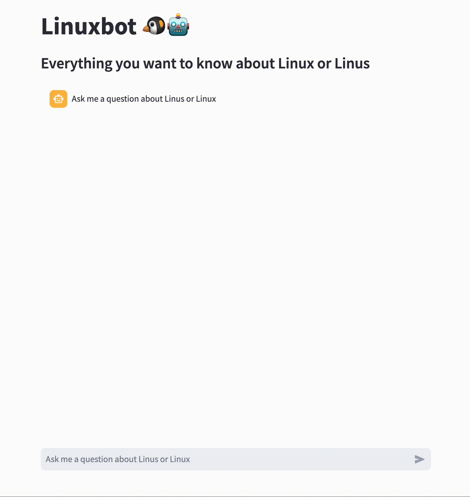

# LLM App Dev Workshop

## Introduction


This repository demonstrates how to build a simple LLM-based chatbot that can answer questions based on your documents (retrieval augmented generation - RAG) and how to deploy it using [Podman](https://podman.io) or on the [OpenShift](https://www.openshift.com) Container Platform (k8s).

The corresponding [workshop](workshop/Darmstadt_v1.md) - first run at [Red Hat Developers Hands-On Day 2023](https://events.redhat.com/profile/form/index.cfm?PKformID=0x900962abcd&sc_cid=7013a000003SlFvAAK) in Darmstadt, Germany - teaches participants the basic concepts of LLMs & RAG, and how to adapt this example implementation to their own specific purpose GPT.

The software stack only uses open source tools [streamlit](https://streamlit.io), [LlamaIndex](https://llamaindex.ai) and local open LLMs via [Ollama](https://ollama.ai). Real open AI for the GPU poor.

Everyone is invited to fork this repository, create their own specific purpose chatbot based on their documents, improve the setup or even hold your own workshop.

## Setup

For the local setup a Mac M1 with 16GB unified memory and above are recommended. First download Ollama from [ollama.ai](https://ollama.ai) and install it.

On Linux you can disable the Ollama service for better debugging:

```
sudo systemctl disable ollama
sudo systemctl stop ollama
```

and then manually run `ollama serve`.

For the local example have a look at the folder `streamlit` and install the requirements.

Create a virtual environment first:
```
python -m venv venv
source venv/bin/activate
```

Install the requirements:
```
pip install -r requirements.txt
```

Then start streamlit with:
```
streamlit run app.py
```



Modify the system prompt and copy different data sources to `docs/` in order to create your own version of the chatbot.
You can set the ollama host via the enviroment variable `OLLAMA_HOST`.

You can download models locally with `ollama pull zephyr` or via API:

```
curl -X POST http://ollama:11434/api/pull -d '{"name": "zephyr"}'
```

First start the ollama service as described and download the [Zephyr model](https://ollama.ai/library/zephyr).
To test the ollama server you can call the generate API:

```
curl -X POST http://ollama:11434/api/generate -d '{"model": "zephyr", "prompt": "Why is the sky blue?"}'
```

All of these commands are also documented in our [cheat sheet](cheatsheet.txt).

## Deployment


### Podman

Build the container based on [UBI9 Python 3.11](https://catalog.redhat.com/software/containers/ubi9/python-311/63f764b03f0b02a2e2d63fff?architecture=amd64&image=654d1ee47c3bfba06c9c59ea):

```
podman build -t linuxbot-app .
```
If you're building on arm64 Mac and deploy on amd64 then generally don't forget to add `--platform` (in this case our base image is amd64 anyways):

```
podman build --platform="linux/amd64" -t linuxbot-app .
```

We will create a network for our linuxbot and ollama:

```
podman network create linuxbot
```

Check if DNS is enabled (it's not on the default net):

```
podman network inspect linuxbot
```

Now you can either start Ollama locally with `ollama serve` or start a Ollama container with

```
podman run --net linuxbot --name ollama -p 11434:11434 --rm docker.io/ollama/ollama:latest
```
 
Note: We just forward the port so we can curl it more easily locally as well.

This ollama service won't have GPU support enabled and much slower compared to running it locally on a Mac M1 for example.

Since we create the embeddings locally in the streamlit app we need to increase shared memory for Pytorch in order to get it running:

```
podman run --net linuxbot --name linuxbot-app -p 8080:8080 --shm-size=2gb -e OLLAMA_HOST=ollama -it --rm localhost/linuxbot-app
```

You can set the Ollama server via the environment variable `OLLAMA_HOST`, the default is `localhost`.

NOTE: It would be much better to generate the embeddings with the ollama service, this is not yet supported in LlamaIndex though.

### OpenShift

Create a new project (namespace) for your workshop and deploy the ollama service in it:

```
oc new-project my-workshop
oc apply -f deployments/ollama.yaml
```

If you want to enable GPU support you have to have to install and instantiate the NVIDIA GPU Operator and Node Feature Discovery (NFD) Operator as described on the [AI on OpenShift](https://ai-on-openshift.io/odh-rhoai/nvidia-gpus/) page, then deploy `ollama-gpu.yaml` instead.

```
oc apply -f deployments/ollama-gpu.yaml
```

The streamlit application (linuxbot) can deployed as:

```
oc apply -f deployments/linuxbot.yaml
```

We have published a preconfigured container image on [quay.io/sroecker](https://quay.io/sroecker/linuxbot-app) that is used in this deployment.

In order to debug your application and ollama service you can deploy a curl image like this:

```
oc run mycurl --image=curlimages/curl -it -- sh
oc attach mycurl -c mycurl -i -t
oc delete pod mycurl
```

## References

- [Build a chatbot with custom data sources, powered by LlamaIndex](https://blog.streamlit.io/build-a-chatbot-with-custom-data-sources-powered-by-llamaindex/)
- [SQL Query Engine with LlamaIndex + DuckDB](https://gpt-index.readthedocs.io/en/latest/examples/index_structs/struct_indices/duckdb_sql_query.html)
- [AI on Openshift - LLMs, Chatbots, Talk with your Documentation](https://ai-on-openshift.io/demos/llm-chat-doc/llm-chat-doc/)
- [Open Sourcerers - A personal AI assistant for developers that doesn't phone home](https://www.opensourcerers.org/2023/11/06/a-personal-ai-assistant-for-developers-that-doesnt-phone-home/)

